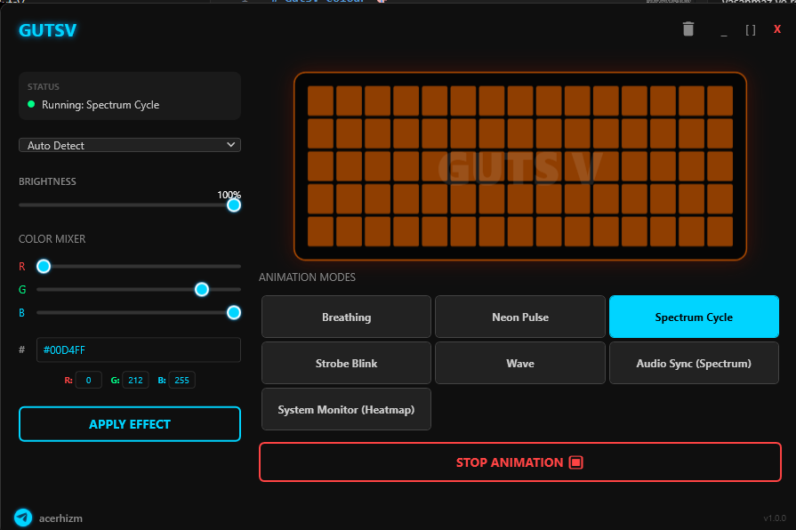

# GutsV Colour 🎨
> **The Next-Gen RGB Control Center for Monster High & Clevo Laptops**

**GutsV Colour** is a lightweight, high-performance, and aesthetically stunning alternative to the stock Control Center software for managing your laptop's RGB keyboard. Built with modern .NET technologies, it eliminates lag, offers advanced animations, and provides a seamless user experience.

## ⚡ Why GutsV?
The default Control Center software is often bloated, slow, and resource-heavy. GutsV changes the game:
*   **Zero Latency:** Custom `AsyncDriverQueue` technology ensures instant lighting response without freezing the UI.
*   **Ultra Lightweight:** Consumes minimal RAM and CPU (<0.1% CPU in background).
*   **System Integration:** Works alongside or replaces your existing RGB controls.

## 🚀 Key Features
*   **🎵 Audio Sync:** Turn your keyboard into a visualizer that reacts to your music and system audio in real-time.
*   **🌡️ System Monitor:** Dynamic lighting that changes color based on your CPU usage/temperature (Green -> Red).
*   **💾 Auto-Persistence:** Remembers your exact color, brightness, and animation state after reboot.
*   **🤖 Smart Start:** Automatically starts with Windows (Bypasses UAC via Task Scheduler) and waits for hardware initialization.
*   **🌌 Animation Engine:**
    *   **Breathe / Fresh Breathe:** Smooth, organic fading effects.
    *   **Color Shift / Transform:** Seamlessly transitions between colors.
    *   **Pulsating Blink:** Alert-style effects.
*   **✨ Cyberpunk UI:** A beautiful, dark-themed interface designed for gamers.

## 💻 Compatibility
Designed primarily for **Monster Notebook** and **Clevo** chassis laptops using:
*   **Insyde DCHU Drivers** (Most modern models)
*   **WMI Interface** (Older/Specific models)
*   *Note: Auto-detects Single-Zone and Multi-Zone layouts.*

## 📦 Installation & Setup
**GutsV is a portable application.** No installer wizard required.

1.  **Download** the latest release.
2.  Extract the folder to a permanent location (e.g., `C:\GutsV`).
3.  Run **`GutsV Colour.exe`**.
4.  **First Run:** You will be asked to enable **Service Mode**. Click **"Yes"**.
    *   *This allows GutsV to start automatically with Windows without annoying admin prompts.*

> **Important:** Keep your original Control Center (FnKey.exe) running in the background. GutsV relies on the low-level drivers initialized by the manufacturer's software.

## 🎮 Usage Guide
*   **System Tray:** GutsV runs silently in the background. Double-click the icon near your clock to open the dashboard.
*   **Trash Icon:** Use the "Cleanup" button in the title bar to reset all settings and remove the auto-start service if you wish to uninstall.
*   **Animations:** Select an animation from the list and click "START".
*   **Static Color:** Stop any animation to apply a static color using the RGB sliders or Hex code.

## 🛠️ Troubleshooting
*   **"Device Not Found":** Ensure your laptop's original Control Center is running. Restart GutsV.
*   **Auto-Start Not Working:** Open GutsV, click the Trash icon (Cleanup), then restart the app and accept the "Service Mode" prompt.

## ⚖️ Disclaimer
This software interacts with hardware drivers. While extensively tested, use it at your own risk. The developer is not responsible for any hardware incompatibilities.

---
*Developed by acerhizm and GutsV*
